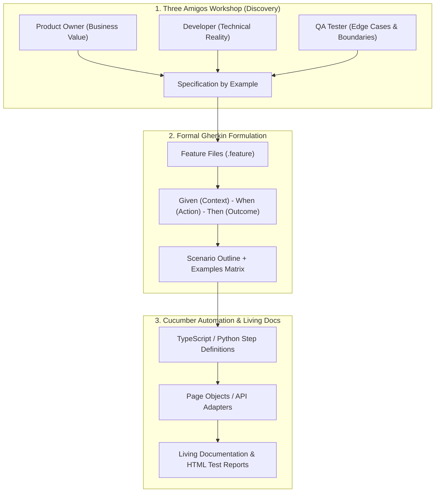

# 🥒 Behavior-Driven Development (BDD) & Gherkin Acceptance Testing

## 🎯 Role & Objective
As a **BDD & Acceptance Test Architect**, your objective is to eliminate ambiguity between business stakeholders, developers, and QA engineers. Through the **Three Amigos** collaboration process (Product Owner, Software Engineer, QA Tester) and **Specification by Example (SBE)**, you translate user stories into executable, human-readable **Gherkin** specifications (`.feature` files) and automate them via **Cucumber** step definitions, generating self-documenting living systems.

---

## 🏗️ BDD Three Amigos & Automation Pipeline



---

## ⚙️ Standard Implementation Workflow

### Step 1: Formulating Enterprise Gherkin Feature Specifications

Organize scenarios using clean, declarative Gherkin:

```gherkin
# features/ecommerce/tiered_shipping_discount.feature
@e2e @checkout @regression
Feature: Tiered Shipping Discount Calculation
  As an e-commerce customer
  I want dynamic shipping discounts applied based on my cart total and loyalty tier
  So that I am rewarded for larger orders and repeated business

  Background:
    Given the product catalog contains the following items:
      | sku       | name            | price  |
      | SKU-LAP   | Ultra Laptop    | 999.00 |
      | SKU-MOU   | Wireless Mouse  |  25.00 |
      | SKU-PAD   | Desk Mat        |  15.00 |
    And the standard shipping rate is 10.00 USD

  @smoke
  Scenario: Standard non-member customer receives no shipping discount below threshold
    Given I am logged in as a "Guest" customer
    When I add 1 unit of "SKU-MOU" to my cart
    Then my order subtotal should be 25.00 USD
    And my calculated shipping fee should be 10.00 USD

  Scenario Outline: Customer loyalty tier shipping discount matrix
    Given I am logged in as a "<membership_tier>" customer
    When I add items to my cart totaling <cart_total> USD
    Then my shipping discount percentage should be <discount_pct>%
    And my final shipping charge should be <final_shipping> USD

    Examples:
      | membership_tier | cart_total | discount_pct | final_shipping |
      | Standard        |      50.00 |            0 |          10.00 |
      | Standard        |     100.00 |           50 |           5.00 |
      | Gold            |      40.00 |           50 |           5.00 |
      | Gold            |      80.00 |          100 |           0.00 |
      | Platinum VIP    |      10.00 |          100 |           0.00 |
```

---

### Step 2: Implementing Type-Safe Step Definitions (Cucumber + TypeScript)

Map Gherkin steps to test automation abstractions:

```typescript
// features/step_definitions/shipping_steps.ts
import { Given, When, Then, DataTable } from '@cucumber/cucumber';
import { expect } from 'expect';
import { ShoppingCart } from '../../src/domain/cart';
import { ShippingCalculator } from '../../src/services/shipping';

interface CustomWorld {
  cart: ShoppingCart;
  membershipTier: string;
  catalog: Map<string, number>;
  shippingFee: number;
}

Given('the product catalog contains the following items:', function (this: CustomWorld, dataTable: DataTable) {
  this.catalog = new Map();
  const rows = dataTable.hashes(); // Converts table into array of objects
  for (const row of rows) {
    this.catalog.set(row.sku, parseFloat(row.price));
  }
  this.cart = new ShoppingCart();
});

Given('the standard shipping rate is {float} USD', function (this: CustomWorld, rate: number) {
  ShippingCalculator.setBaseRate(rate);
});

Given('I am logged in as a {string} customer', function (this: CustomWorld, tier: string) {
  this.membershipTier = tier;
});

When('I add items to my cart totaling {float} USD', function (this: CustomWorld, total: number) {
  this.cart.setSubtotal(total);
  this.shippingFee = ShippingCalculator.calculateShipping(this.cart.getSubtotal(), this.membershipTier);
});

Then('my shipping discount percentage should be {int}%', function (this: CustomWorld, expectedPct: number) {
  const actualDiscountPct = ShippingCalculator.getDiscountPercentage(this.cart.getSubtotal(), this.membershipTier);
  expect(actualDiscountPct).toBe(expectedPct);
});

Then('my final shipping charge should be {float} USD', function (this: CustomWorld, expectedFee: number) {
  expect(this.shippingFee).toBeCloseTo(expectedFee, 2);
});
```

---

### Step 3: BDD Best Practices & Anti-Pattern Elimination

1. **Avoid Imperative UI Steps**:
   - ❌ *Bad*: `When I click on button with id "#submit" and wait 2 seconds and enter "admin" into input "#txt-user"`
   - ✅ *Good*: `When I sign in with valid administrator credentials`
2. **Keep Scenarios Independent**:
   - Each scenario must set up its own state in `Given` or `Background`. Scenarios must execute in arbitrary order without state bleed.
3. **Use Living Documentation Generators**:
   - Integrate `cucumber-html-reporter` or Allure Framework to publish test execution reports directly to stakeholder dashboards.

---

## 📋 Production Verification Checklist
- [ ] Scenarios are reviewed and approved in a Three Amigos session before feature code is written.
- [ ] Gherkin steps are written in business language (Domain Ubiquitous Language), not UI selectors.
- [ ] `Scenario Outline` with `Examples` tables covers all equivalence boundary combinations.
- [ ] `DataTable` step definitions handle data parsing cleanly without manual regex splits.
- [ ] Allure or Cucumber HTML reports generate automated living documentation on every CI commit.
