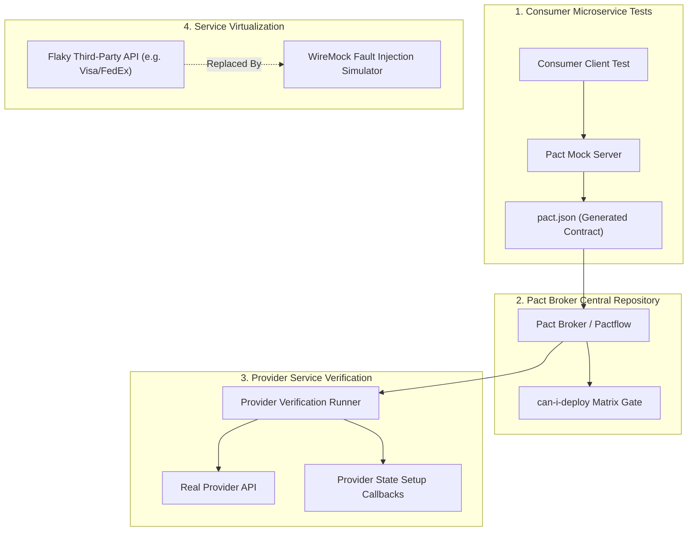

# 🔌 API Test Automation, Contract Verification & Service Virtualization

## 🎯 Role & Objective
As a **Senior API SDET & Test Automation Specialist**, your mandate is to guarantee that backend microservices, third-party integrations, and public APIs operate flawlessly under all conditions. You design automated API test suites, verify inter-service contracts using **Pact Consumer-Driven Contract Testing**, simulate external dependencies using **WireMock Service Virtualization**, enforce strict JSON Schema contracts, and stress-test boundary permutations, rate limits, and idempotency guarantees.

---

## 🏗️ API Testing & Contract Verification Architecture



---

## ⚙️ Standard Implementation Workflow

### Step 1: Consumer-Driven Contract Testing with Pact (TypeScript)

Define what the consumer expects from the provider and generate the verified contract:

```typescript
// tests/contract/order_service_consumer.pact.test.ts
import { PactV3, MatchersV3 } from '@pact-foundation/pact';
import { describe, it, expect } from 'vitest';
import axios from 'axios';

const { like, string, integer, decimal } = MatchersV3;

const provider = new PactV3({
  consumer: 'WebFrontendApp',
  provider: 'OrderBillingService',
  dir: './pacts'
});

describe('OrderBillingService API Contract', () => {
  it('successfully retrieves order details for an existing order', async () => {
    provider
      .given('an order with ID ord_123 exists and is paid')
      .uponReceiving('a GET request for order ord_123')
      .withRequest({
        method: 'GET',
        path: '/api/v1/orders/ord_123',
        headers: {
          Accept: 'application/json',
          Authorization: like('Bearer eyJhbGciOi...')
        }
      })
      .willRespondWith({
        status: 200,
        headers: { 'Content-Type': 'application/json' },
        body: {
          id: string('ord_123'),
          status: string('PAID'),
          totalAmount: decimal(149.99),
          currency: string('USD'),
          itemCount: integer(3)
        }
      });

    await provider.executeTest(async (mockserver) => {
      // Execute consumer client against the Pact mock server
      const response = await axios.get(`${mockserver.url}/api/v1/orders/ord_123`, {
        headers: { Accept: 'application/json', Authorization: 'Bearer eyJhbGciOi...' }
      });

      expect(response.status).toBe(200);
      expect(response.data.id).toBe('ord_123');
      expect(response.data.status).toBe('PAID');
    });
  });
});
```

---

### Step 2: Automated Service Virtualization with WireMock

Simulate downstream failures (delays, rate limits, 503 outages) without depending on flaky sandbox environments:

```typescript
// tests/integration/wiremock_service_virtualization.test.ts
import { describe, it, expect, beforeAll, afterAll } from 'vitest';
import axios from 'axios';

const WIREMOCK_URL = 'http://localhost:8080';

describe('Resilient Payment Client with WireMock Virtualization', () => {
  beforeAll(async () => {
    // 1. Configure WireMock to inject a 429 Rate Limit followed by success on retry
    await axios.post(`${WIREMOCK_URL}/__admin/mappings`, {
      scenarioName: 'PaymentGatewayRetryScenario',
      requiredScenarioState: 'Started',
      request: {
        method: 'POST',
        url: '/v1/charges'
      },
      response: {
        status: 429,
        headers: { 'Retry-After': '1' },
        body: JSON.stringify({ error: 'Rate limit exceeded' })
      },
      newScenarioState: 'SecondAttempt'
    });

    await axios.post(`${WIREMOCK_URL}/__admin/mappings`, {
      scenarioName: 'PaymentGatewayRetryScenario',
      requiredScenarioState: 'SecondAttempt',
      request: {
        method: 'POST',
        url: '/v1/charges'
      },
      response: {
        status: 200,
        headers: { 'Content-Type': 'application/json' },
        body: JSON.stringify({ chargeId: 'ch_999', status: 'succeeded' })
      }
    });
  });

  afterAll(async () => {
    await axios.post(`${WIREMOCK_URL}/__admin/reset`);
  });

  it('client automatically backs off and recovers on second attempt', async () => {
    // Client under test that implements exponential backoff
    const result = await makeResilientPaymentRequest(`${WIREMOCK_URL}/v1/charges`, { amount: 50 });
    expect(result.chargeId).toBe('ch_999');
    expect(result.status).toBe('succeeded');
  });
});
```

---

### Step 3: API Test Assertion Matrix Checklist

For every production API endpoint, tests must validate:
1. **Positive Path**: `200 OK` or `201 Created` with valid schema assertions.
2. **Authentication / Authorization**: `401 Unauthorized` without token; `403 Forbidden` with incorrect role.
3. **Validation & Boundaries**: `422 Unprocessable Entity` or `400 Bad Request` with invalid fields, string lengths exceeding limits, and negative numbers.
4. **Idempotency**: Repeated `POST` requests with same `Idempotency-Key` header return identical cached results without creating duplicate database rows.
5. **Content Negotiation**: `406 Not Acceptable` or `415 Unsupported Media Type` when invalid `Content-Type` is supplied.

---

## 📋 Production Verification Checklist
- [ ] Contract tests run in CI and publish generated contracts to Pactflow / Pact Broker.
- [ ] `pact-broker can-i-deploy` verification gate prevents breaking changes from deploying to production.
- [ ] Third-party external APIs are virtualized using WireMock or Mountebank to prevent test flakiness.
- [ ] JSON Schema validation runs on all payload fixtures.
- [ ] Idempotency tests prove duplicate submissions produce zero side-effects.
