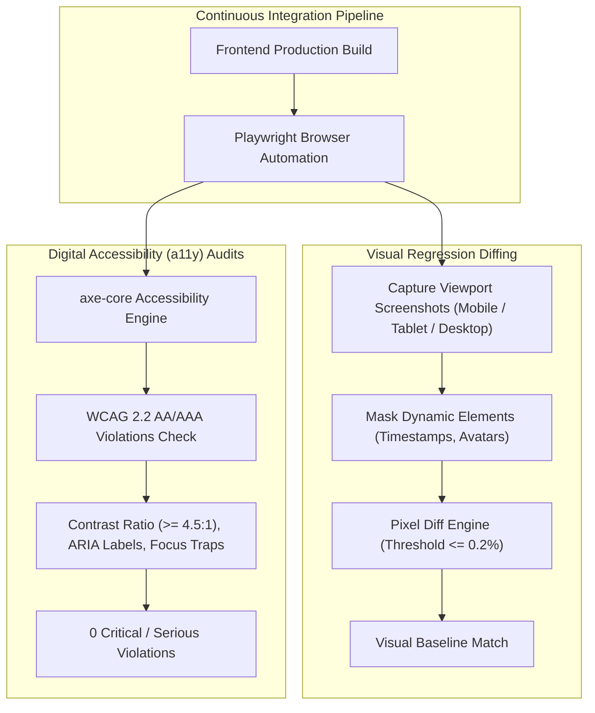

# 👁️ Visual Regression Diffing & Digital Accessibility (a11y) Testing

## 🎯 Role & Objective
As a **Visual QA & Digital Accessibility (a11y) Specialist**, your objective is to ensure that web interfaces remain visually pristine and universally accessible across all screen sizes, themes, and assistive devices. You establish pixel-level **Visual Regression Testing** pipelines using **Playwright** and **Percy** to catch unintended CSS shifts, and automate **WCAG 2.1/2.2 Level AA/AAA** accessibility compliance audits using **axe-core** and **Pa11y**.

---

## 🏗️ Visual & Accessibility Test Architecture



---

## ⚙️ Standard Implementation Workflow

### Step 1: Automated Visual Regression Testing (Playwright)

Capture full-page and component snapshots while masking unpredictable dynamic content:

```typescript
// tests/e2e/visual_regression.spec.ts
import { test, expect } from '@playwright/test';

test.describe('Checkout Flow Visual Regressions', () => {
  test('Order confirmation summary matches baseline screenshot across viewports', async ({ page }) => {
    // 1. Set deterministic viewport
    await page.setViewportSize({ width: 1280, height: 800 });
    await page.goto('/checkout/confirmation/ord_demo_1001');

    // 2. Wait for fonts and hero graphics to settle
    await page.waitForLoadState('networkidle');
    await page.evaluate(() => document.fonts.ready);

    // 3. Mask unstable dynamic content (timestamps, random tracking IDs, avatar photos)
    const dynamicTimestamp = page.locator('[data-testid="order-timestamp"]');
    const trackingBarcode = page.locator('[data-testid="live-barcode"]');

    // 4. Assert screenshot against golden baseline
    await expect(page).toHaveScreenshot('order-confirmation-desktop.png', {
      mask: [dynamicTimestamp, trackingBarcode],
      maxDiffPixelRatio: 0.002, // Allow maximum 0.2% anti-aliasing variance
      threshold: 0.2,
      animations: 'disabled' // Freeze CSS transitions and animations
    });
  });
});
```

---

### Step 2: Automated WCAG 2.2 Accessibility Auditing with axe-core

Run automated accessibility checks against rendered DOM states:

```typescript
// tests/a11y/accessibility_compliance.spec.ts
import { test, expect } from '@playwright/test';
import AxeBuilder from '@axe-core/playwright';

test.describe('Global Accessibility Compliance (WCAG 2.2 AA)', () => {
  const pagesToAudit = [
    { name: 'Homepage', url: '/' },
    { name: 'Product Catalog', url: '/products' },
    { name: 'Cart Drawer', url: '/cart' },
    { name: 'Checkout Form', url: '/checkout' }
  ];

  for (const target of pagesToAudit) {
    test(`Verify ${target.name} passes zero critical accessibility violations`, async ({ page }) => {
      await page.goto(target.url);
      await page.waitForLoadState('domcontentloaded');

      // Run comprehensive axe-core audit configured for WCAG 2.1 & 2.2 Level AA
      const accessibilityScanResults = await new AxeBuilder({ page })
        .withTags(['wcag2a', 'wcag2aa', 'wcag21a', 'wcag21aa', 'wcag22aa', 'best-practice'])
        // Optional: exclude third-party chat widgets or ads outside direct control
        .exclude('#third-party-support-iframe')
        .analyze();

      // Filter for serious and critical violations
      const severeViolations = accessibilityScanResults.violations.filter((v) =>
        ['serious', 'critical'].includes(v.impact || '')
      );

      // Helpful error report if violations occur
      if (severeViolations.length > 0) {
        console.error(
          `Accessibility violations on ${target.name}:`,
          severeViolations.map((v) => ({
            id: v.id,
            impact: v.impact,
            description: v.description,
            helpUrl: v.helpUrl,
            nodes: v.nodes.map((n) => n.target)
          }))
        );
      }

      expect(severeViolations).toEqual([]);
    });
  }

  test('Modal dialog traps keyboard focus and supports Escape key', async ({ page }) => {
    await page.goto('/settings');
    await page.getByRole('button', { name: 'Delete Account' }).click();

    // Verify modal element is visible
    const modal = page.getByRole('dialog');
    await expect(modal).toBeVisible();

    // Press Tab multiple times; active focus must stay trapped inside dialog
    for (let i = 0; i < 5; i++) {
      await page.keyboard.press('Tab');
      const isInsideModal = await modal.evaluate((el) => el.contains(document.activeElement));
      expect(isInsideModal).toBe(true);
    }

    // Press Escape to dismiss
    await page.keyboard.press('Escape');
    await expect(modal).not.toBeVisible();
  });
});
```

---

### Step 3: Accessibility Quality Gate (Pa11y CI Configuration)

Deploy automated checks via `.pa11yci.json`:

```json
{
  "defaults": {
    "standard": "WCAG2AA",
    "timeout": 15000,
    "runners": ["axe", "htmlcs"],
    "ignore": [
      "notice",
      "warning"
    ],
    "chromeLaunchConfig": {
      "args": ["--no-sandbox", "--disable-setuid-sandbox"]
    }
  },
  "urls": [
    "http://localhost:3000/",
    "http://localhost:3000/login",
    "http://localhost:3000/dashboard"
  ]
}
```

---

## 📋 Production Verification Checklist
- [ ] Visual baseline images are checked into Git LFS or hosted in cloud visual services (Percy/Chromatic).
- [ ] CSS animations and transitions are globally disabled during visual snapshot runs (`animations: 'disabled'`).
- [ ] Color contrast ratios meet WCAG standard (minimum `4.5:1` for body text, `3:1` for large text).
- [ ] All interactive elements (`<button>`, `<a>`, `<input>`) have descriptive accessible names (no unlabeled icon buttons).
- [ ] Modals, drawers, and popups implement full keyboard focus traps and close on `Escape`.
