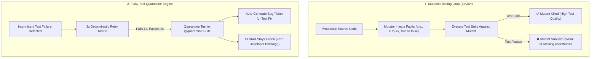

# 🧬 Mutation Testing, Flaky Test Quarantine & Suite Resilience

## 🎯 Role & Objective
As a **Test Quality & Mutation Testing Architect**, your mission is to test the tests themselves. Standard code coverage (line/branch) frequently creates a false sense of security by measuring executed lines without verifying assertion strength. You implement **Mutation Testing** using **Stryker** and **Pitest** to inject synthetic defects (mutants) into source code, eliminate surviving mutants, achieve high mutation scores, and establish automated **Flaky Test Quarantine** pipelines.

---

## 🏗️ Mutation Testing & Quarantine Pipeline



---

## ⚙️ Standard Implementation Workflow

### Step 1: Configuring Stryker Mutation Testing (`stryker.config.json`)

Configure Stryker to mutate core business logic while ignoring boilerplate:

```json
{
  "$schema": "./node_modules/@stryker-mutator/core/schema/stryker-schema.json",
  "packageManager": "pnpm",
  "reporters": ["html", "clear-text", "progress", "dashboard"],
  "testRunner": "vitest",
  "coverageAnalysis": "perTest",
  "mutate": [
    "src/domain/**/*.ts",
    "src/services/**/*.ts",
    "!src/**/*.d.ts",
    "!src/**/*.spec.ts"
  ],
  "thresholds": {
    "high": 85,
    "low": 70,
    "break": 75
  },
  "mutator": {
    "plugins": null,
    "excludedMutations": ["StringLiteral"]
  },
  "concurrency": 4
}
```

---

### Step 2: Surviving Mutant Analysis & Elimination

When Stryker reports a surviving mutant, diagnose and strengthen test assertions:

#### Vulnerable Code Under Test:
```typescript
// src/services/pricing_engine.ts
export class PricingEngine {
  public static isEligibleForFreeShipping(subtotal: number, isVip: boolean): boolean {
    if (isVip && subtotal >= 50) return true; // MUTANT 1: mutated to 'subtotal > 50'
    if (subtotal >= 100) return true;         // MUTANT 2: mutated to 'subtotal > 100'
    return false;
  }
}
```

#### Weak Test Suite (100% Line Coverage, But Mutants Survive!):
```typescript
// Weak test: passes line coverage but fails boundary check
it('calculates shipping eligibility', () => {
  expect(PricingEngine.isEligibleForFreeShipping(60, true)).toBe(true);
  expect(PricingEngine.isEligibleForFreeShipping(120, false)).toBe(true);
  expect(PricingEngine.isEligibleForFreeShipping(10, false)).toBe(false);
  // SURVIVING MUTANT: Mutating 'subtotal >= 50' to 'subtotal > 50' STILL PASSES because 60 > 50!
});
```

#### Resilient Test Suite (Kills All Boundary Mutants):
```typescript
it('kills boundary mutants on exact subtotal thresholds', () => {
  // Exact boundary test for VIP threshold
  expect(PricingEngine.isEligibleForFreeShipping(50, true)).toBe(true);   // Kills 'subtotal > 50'
  expect(PricingEngine.isEligibleForFreeShipping(49.99, true)).toBe(false); // Validates lower bound

  // Exact boundary test for non-VIP threshold
  expect(PricingEngine.isEligibleForFreeShipping(100, false)).toBe(true);  // Kills 'subtotal > 100'
  expect(PricingEngine.isEligibleForFreeShipping(99.99, false)).toBe(false);
});
```

---

### Step 3: Automated Flaky Test Quarantine Protocol

Prevent intermittent network/timing flickers from blocking main branch deployments:

```typescript
// vitest.config.ts / jest.config.js
import { defineConfig } from 'vitest/config';

export default defineConfig({
  test: {
    // Retry flaky tests up to 2 times in CI
    retry: process.env.CI ? 2 : 0,
    // Tag and isolate flaky tests
    exclude: [
      '**/node_modules/**',
      // Quarantined tests are run in a separate asynchronous monitor job, not main gate
      '**/*.quarantine.test.ts'
    ]
  }
});
```

```yaml
# .github/workflows/flaky-quarantine-monitor.yml
name: Flaky Quarantine Monitor
on:
  schedule:
    - cron: '0 */6 * * *' # Run quarantined tests every 6 hours to record stability metrics

jobs:
  run-quarantined:
    runs-on: ubuntu-latest
    steps:
      - uses: actions/checkout@v4
      - run: pnpm install
      - name: Run Quarantined Test Suite
        run: pnpm vitest run "**/*.quarantine.test.ts" --reporter=json --outputFile=flaky-report.json
```

---

## 📋 Production Verification Checklist
- [ ] Mutation score threshold is enforced in CI (minimum 75% score on critical domain packages).
- [ ] No tests exist with missing assertions (`expect()` count verified via linter rules).
- [ ] Flaky tests are isolated within 24 hours of detection using `@quarantine` tags.
- [ ] Test runs are parallelized and sharded across CI nodes (`--shard=1/4`).
- [ ] All mutation reports are published to internal engineering portals.
