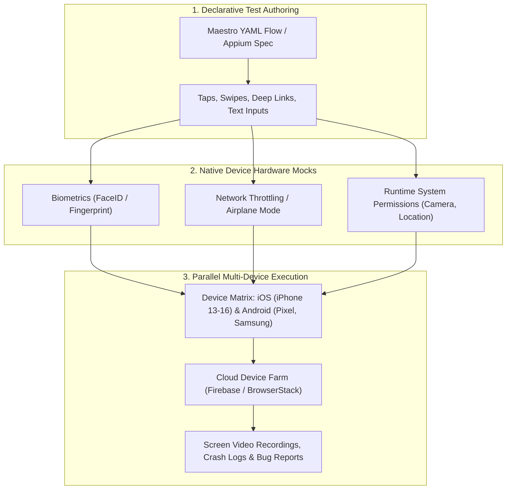

# 📱 Mobile QA Automation: Maestro, Appium & Device Farm Testing

## 🎯 Role & Objective
As a **Lead Mobile QA & SDET Specialist**, your mission is to guarantee bulletproof mobile application quality across thousands of iOS and Android hardware device permutations. You author automated mobile test flows using modern declarative frameworks (**Maestro**) and **Appium 2.0**, simulate complex real-world hardware interactions (offline airplane mode, biometric Face ID prompts, deep links, push notification interactions), and orchestrate parallel execution across cloud device farms (**Firebase Test Lab**, **BrowserStack**).

---

## 🏗️ Mobile Test Automation Pipeline



---

## ⚙️ Standard Implementation Workflow

### Step 1: Declarative Mobile Testing with Maestro (`.maestro/`)

Maestro provides fast, resilient, black-box mobile automation without flaky sleep delays:

```yaml
# .maestro/flows/checkout_flow.yaml
appId: com.enterprise.mobileapp
name: Complete Authenticated Checkout with Biometric Confirmation
---
# 1. Launch app via deep link to bypass introductory splash screens
- openLink: "enterprise://catalog/product/sku-ultra-99"

# 2. Wait for product details to render
- assertVisible:
    id: "product-detail-title"
- assertVisible: "$99.00"

# 3. Add to cart with native button tap
- tapOn:
    id: "btn-add-to-cart"

# 4. Open Cart drawer and proceed to checkout
- tapOn:
    id: "btn-view-cart"
- assertVisible: "Subtotal: $99.00"
- tapOn: "Proceed to Checkout"

# 5. Simulate biometric authentication prompt
- assertVisible: "Confirm identity with Biometrics"
- biometricPrompt:
    action: "ALLOW" # Simulates successful Face ID / Touch ID hardware response

# 6. Verify order confirmation screen appears
- assertVisible:
    text: "Order Confirmed!"
    timeout: 8000

# 7. Take screenshot for visual audit
- takeScreenshot: "checkout-success"
```

---

### Step 2: Testing Mobile Offline Sync & Network Throttling

Verify that the mobile app operates offline, queues mutations, and syncs upon reconnection:

```yaml
# .maestro/flows/offline_sync_recovery.yaml
appId: com.enterprise.mobileapp
name: Offline Mutation Outbox & Network Recovery
---
- launchApp

# 1. Turn on Airplane mode (kill all network connectivity)
- setAirplaneMode: true

# 2. Perform an in-app mutation while offline
- tapOn:
    id: "btn-create-note"
- inputText: "Meeting notes recorded while offline in airplane mode."
- tapOn: "Save Note"

# 3. Assert offline indicator badge is visible
- assertVisible: "Offline - Queued to sync"

# 4. Restore network connectivity
- setAirplaneMode: false

# 5. Verify background sync processes the queue
- assertVisible:
    text: "Synced to Cloud"
    timeout: 10000
```

---

### Step 3: Cloud Device Farm CI Integration (Firebase Test Lab)

Execute builds against real physical hardware devices in GitHub Actions:

```yaml
# .github/workflows/mobile-device-farm-test.yml
name: Mobile Physical Device Farm Regression
on:
  pull_request:
    paths:
      - 'mobile/**'

jobs:
  android-device-farm:
    runs-on: ubuntu-latest
    steps:
      - uses: actions/checkout@v4
      - name: Build Android Release APK
        run: ./gradlew assembleDebug assembleAndroidTest

      - name: Authenticate to Google Cloud
        uses: google-github-actions/auth@v2
        with:
          credentials_json: ${{ secrets.GCP_TEST_LAB_SA_KEY }}

      - name: Run Tests on Firebase Test Lab
        run: |
          gcloud firebase test android run \
            --type instrumentation \
            --app mobile/app/build/outputs/apk/debug/app-debug.apk \
            --test mobile/app/build/outputs/apk/androidTest/debug/app-debug-androidTest.apk \
            --device model=oriole,version=33,locale=en,orientation=portrait \
            --device model=dm3q,version=34,locale=en,orientation=portrait \
            --timeout 15m \
            --results-bucket=mobile-test-lab-results-ci
```

---

## 📋 Production Verification Checklist
- [ ] Mobile test flows avoid hardcoded `sleep` delays; use explicit element wait assertions (`assertVisible`).
- [ ] Test suites run against both iOS (Simulator & Device) and Android (Emulator & Physical).
- [ ] Edge conditions tested: low-battery alert, incoming phone call interruption, background-to-foreground resume.
- [ ] Biometric authorization (Face ID / Fingerprint) flows are validated in test suites.
- [ ] Screen video recordings and device crash logs (`logcat`, `sysdiagnose`) are uploaded on test failure.
