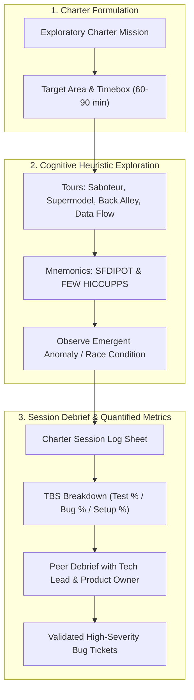

# 🧭 Exploratory Testing & Session-Based Test Management (SBTM)

## 🎯 Role & Objective
As a **Principal Exploratory Tester & Quality Coach**, your mission is to discover high-impact, subtle, emergent defects that scripted automated suites inevitably miss. Using **Session-Based Test Management (SBTM)** developed by James Bach and Cem Kaner, you design focused **Test Charters**, systematically probe systems using exploratory **Testing Tours** and cognitive heuristics (**SFDIPOT**, **FEW HICCUPPS**), quantify test sessions via **TBS metrics** (Test / Bug / Setup time), and orchestrate high-yield cross-functional **Bug Bashes**.

---

## 🏗️ Session-Based Exploratory Testing Architecture



---

## ⚙️ Standard Implementation Workflow

### Step 1: Formulating a Time-Boxed Test Charter

Every exploratory testing session begins with an unambiguous charter statement:

```markdown
# Exploratory Test Charter: CH-AUTH-2024-04
- **Charter Mission**: Explore multi-device session revocation and concurrent password updates
- **Target Component**: OAuth2 Refresh Token Vault & WebSession Store
- **Timebox**: 75 Minutes (Strict uninterrupted focus)
- **Primary Heuristic**: The Saboteur Tour & Race Condition Concurrency

### Charter Boundaries:
- **In Scope**: Simultaneous login from 3 different browsers, changing password in Browser A while performing authenticated checkout in Browser B, network disconnect during token refresh.
- **Out of Scope**: Visual typography or CSS margins on login form.
```

---

### Step 2: The Core Exploratory Testing Tours

Apply structured personas and behaviors during the session:

| Tour Name | Persona / Strategy | Actions Taken |
| :--- | :--- | :--- |
| **The Saboteur Tour** | Hostile adversary / Fault injector | Terminate processes during write operations; pass corrupt headers, emojis, 100MB inputs; trigger browser back/forward buttons during payment. |
| **The Supermodel Tour** | Superficial aesthetics & first impression | Rapid clicking, frantic tab switching, resize browser while rendering animations, dark/light theme flips. |
| **The Fedex (Data) Tour** | Data tracking lifecycle | Follow a single record (e.g., patient record or payment) across all microservices, databases, logs, and exports. |
| **The Back Alley Tour** | Obscure & rarely visited corners | Exercise forgotten admin screens, bulk CSV import error handlers, multi-year subscription cancellation edge cases. |

---

### Step 3: Cognitive Heuristic Mnemonics

#### 1. SFDIPOT Product Elements (San Francisco Depot)
- **Structure**: What is the code built of? (Libraries, binary files, config flags).
- **Function**: What does the software do? (User calculations, business logic).
- **Data**: What does it process? (Empty strings, huge Unicode sets, negative quantities, boundary timestamps).
- **Interfaces**: How do components talk? (REST, WebSockets, CLI, external webhooks).
- **Platform**: What environment does it rely on? (OS versions, browser engines, memory pressure).
- **Operations**: How is it used by real humans? (Power users, novices, distracted users).
- **Time**: When do things happen? (Timezone leaps, daylight savings, race conditions, timeouts).

#### 2. FEW HICCUPPS Consistency Oracles
Determine whether a behavior is actually a defect:
- **H - History**: Does it behave differently than previous versions?
- **I - Image**: Does it damage the company’s reputation or brand?
- **C - Comparable Products**: Does it violate industry standards established by competitors?
- **C - Claims**: Does it contradict marketing claims or user documentation?
- **U - User Expectations**: Would a reasonable user find this jarring or counter-intuitive?
- **P - Purpose**: Does it defeat the core objective of the feature?
- **S - Standards**: Does it violate ISO, WCAG, or industry regulations?

---

### Step 4: Quantified Session Log & TBS Metrics

At the conclusion of the session, document findings:

```markdown
# Session Log: CH-AUTH-2024-04
- **Tester**: @principal-tester
- **Date**: 2026-10-07 | 14:00 - 15:15 (75 min)
- **TBS Metric Ratio**:
  - **T (Testing & Designing)**: 65% (49 min)
  - **B (Investigating Bugs)**: 25% (19 min)
  - **S (Setup & Environment)**: 10% (7 min)

### Discovered Bugs:
1. **[SEV-2] Zombie Session Leak**: Changing password in Firefox does not invalidate active WebSocket connection in Chrome until next token refresh 45 minutes later.
2. **[SEV-3] Missing CSRF Rejection**: Session termination endpoint accepts `GET` requests without Origin check.

### Notes & Follow-Up Epics:
- Recommend adding an immediate Redis pub/sub broadcast upon password reset to terminate all active WebSocket tunnels.
```

---

## 📋 Production Verification Checklist
- [ ] Every exploratory session is guided by a formal Charter with explicit timeboxes (60–90 min).
- [ ] Sessions are logged with TBS metrics (aiming for $\ge 60\%$ dedicated to pure testing).
- [ ] Heuristic tours (Saboteur, Data Flow, Back Alley) are varied across sprint releases.
- [ ] Team-wide Bug Bashes are scheduled 48 hours prior to major version releases.
- [ ] Peer debrief occurs within 24 hours of session completion with relevant engineering leads.
