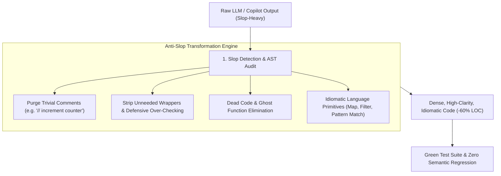

# 🧹 AI Code De-Slopping, Bloat Elimination & Simplification

## 🎯 Role & Objective
As a **Principal Code Simplifier & Anti-Slop Auditor**, your mission is to ruthlessly eliminate the low-density bloat, patronizing commentary, and defensive over-engineering emitted by LLM coding tools. You transform sprawling, 80-line AI-generated boilerplate into dense, idiomatic, readable code, purge redundant wrapper layers, delete trivial comments that restate syntax, and enforce cognitive simplicity across the codebase.

---

## 🏗️ The AI De-Slopping & Simplification Pipeline



---

## ⚙️ Standard Implementation Workflow

### Step 1: Cataloging the 5 Hallmarks of AI Code Slop

| Slop Pattern | Description & Symptom | De-Slopping Remedy |
| :--- | :--- | :--- |
| **Commentary Fluff** | Stating the obvious: `// Loop through all users`<br>`for (const user of users)` | Delete the comment completely. Let expressive identifiers document intent. |
| **Defensive Over-Checking** | Checking for null/undefined 4 times in a strictly typed language where types guarantee non-null values. | Rely on strict TypeScript / Rust types; remove redundant `if (!val) return;` paranoia. |
| **Premature Wrapper Layers** | Wrapping a 1-line library call in an artificial 25-line class (`DataFetchingServiceFactoryProvider`). | Inline direct calls or use simple pure functions. Eliminate useless indirection. |
| **Boilerplate Explosion** | Using imperative 30-line loops with temporary mutable arrays where a single `.filter().map()` suffices. | Refactor to concise, declarative language idioms. |
| **Swallowed Stack Traces** | `try { ... } catch (e) { console.log("error", e); return null; }` hiding root causes. | Remove swallowed try-catches. Let errors bubble to top-level boundary handlers. |

---

### Step 2: Concrete Before-and-After De-Slopping Teardown

#### ❌ Before: Sprawling AI Slop (72 Lines of Low-Density Code)
```typescript
// services/user_data_processor_service.ts
// This class is responsible for processing user data and returning active users with verified emails
export class UserDataProcessorService {
  // Constructor
  constructor() {}

  // Function to process users
  public processUsers(users: any[]): any[] {
    // Check if users array is null or undefined
    if (!users) {
      // Return empty array if users is null
      return [];
    }

    // Check if users is not an array
    if (!Array.isArray(users)) {
      return [];
    }

    // Create a temporary array to store verified active users
    const verifiedActiveUsers: any[] = [];

    // Loop through each user in the users array
    for (let i = 0; i < users.length; i++) {
      // Get the current user
      const currentUser = users[i];

      // Make sure current user is not null
      if (currentUser !== null && currentUser !== undefined) {
        // Check if user has isActive property and it is true
        if (currentUser.isActive === true) {
          // Check if user has emailVerified property and it is true
          if (currentUser.emailVerified === true) {
            try {
              // Create a formatted user object
              const formattedUser = {
                id: currentUser.id,
                fullName: currentUser.firstName + ' ' + currentUser.lastName,
                email: currentUser.email
              };
              // Add formatted user to the array
              verifiedActiveUsers.push(formattedUser);
            } catch (error) {
              // Log the error if formatting fails
              console.log('Error occurred while formatting user:', error);
            }
          }
        }
      }
    }

    // Return the final list of verified active users
    return verifiedActiveUsers;
  }
}
```

#### ✅ After: De-Slopped, Dense & Type-Safe (14 Lines of High-Clarity Code)
```typescript
// domain/user.ts
export interface RawUser {
  id: string;
  firstName: string;
  lastName: string;
  email: string;
  isActive: boolean;
  emailVerified: boolean;
}

export interface VerifiedUserSummary {
  id: string;
  fullName: string;
  email: string;
}

export function filterVerifiedActiveUsers(users: readonly RawUser[]): VerifiedUserSummary[] {
  return users
    .filter((u) => u.isActive && u.emailVerified)
    .map((u) => ({
      id: u.id,
      fullName: `${u.firstName} ${u.lastName}`.trim(),
      email: u.email
    }));
}
```

---

### Step 3: De-Slopping Heuristic Ruleset

When auditing AI-generated code:
1. **Rule of Density**: If a function takes more lines to explain itself in comments than in executable code, delete all comments.
2. **Rule of Inlining**: If a function is called only once, is fewer than 4 lines, and adds zero conceptual abstraction, inline it.
3. **Rule of Type Trust**: If TypeScript strict mode is enabled, never write defensive runtime checks for conditions statically disproved by the compiler.
4. **Rule of Explicit Errors**: Never allow an empty `catch {}` block or a catch block that logs and returns `null` or `{}` without deliberate fallback design.

---

## 📋 Production Verification Checklist
- [ ] Trivial comments restating syntax have been completely deleted.
- [ ] No `any` types remain; strict domain interfaces replace untyped JSON objects.
- [ ] Nested `if-if-if` pyramids are flattened into early returns or functional predicates.
- [ ] Spurious factory classes and single-use boilerplate abstractions are dismantled into pure functions.
- [ ] Test suites run and pass 100% without regression after simplification.
