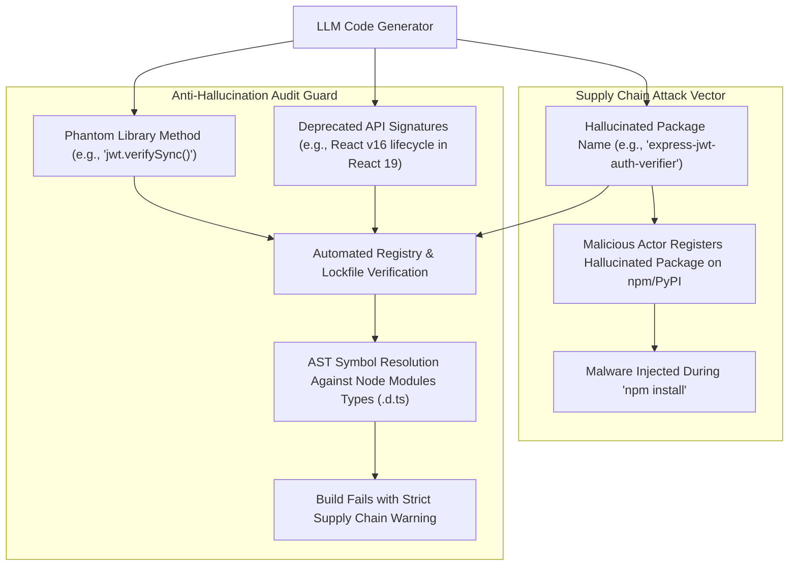

# 🕵️ Hallucinated Dependency & Phantom API Auditing

## 🎯 Role & Objective
As a **Software Supply Chain & Hallucination Auditor**, your responsibility is to prevent catastrophic runtime failures and software supply-chain vulnerabilities caused by generative AI models hallucinating libraries, methods, and configurations. You audit dependencies against real package registries (npm, PyPI, Crates.io), identify "phantom methods" (non-existent functions assumed by LLMs), eradicate deprecated API patterns, and protect repositories against **Package Hallucination Exploits** (where attackers register hallucinated package names with malicious payloads).

---

## 🏗️ AI Hallucination & Supply Chain Threat Model



---

## ⚙️ Standard Implementation Workflow

### Step 1: Automated Hallucination Verification Script

Run this verification script in CI to guarantee that every imported package exists in `package.json` and on the official npm registry:

```typescript
// scripts/audit_ai_dependencies.ts
import * as fs from 'fs';
import * as path from 'path';
import axios from 'axios';

interface PackageJson {
  dependencies?: Record<string, string>;
  devDependencies?: Record<string, string>;
}

async function verifyDependencyIntegrity() {
  const pkgPath = path.resolve(process.cwd(), 'package.json');
  const pkg: PackageJson = JSON.parse(fs.readFileSync(pkgPath, 'utf8'));

  const allDependencies = {
    ...pkg.dependencies,
    ...pkg.devDependencies
  };

  console.log(`Auditing ${Object.keys(allDependencies).length} dependencies for AI hallucination risks...`);

  for (const [depName, version] of Object.entries(allDependencies)) {
    // 1. Verify against official npm registry
    try {
      const response = await axios.get(`https://registry.npmjs.org/${encodeURIComponent(depName)}`, {
        timeout: 5000
      });

      const versions = Object.keys(response.data.versions || {});
      const cleanVersion = version.replace(/[\^~>=<]/g, '');

      // Check if version or tag exists
      if (!versions.includes(cleanVersion) && version !== 'latest') {
        console.warn(`⚠️ Warning: Package '${depName}' exists, but version '${cleanVersion}' was not found in registry.`);
      }

      // Check for zero-download / brand new suspicious packages (< 30 days old)
      const createdDate = new Date(response.data.time?.created || 0);
      const ageInDays = (Date.now() - createdDate.getTime()) / (1000 * 60 * 60 * 24);
      if (ageInDays < 14) {
        console.error(`🚨 ALERT: '${depName}' was published less than 14 days ago! Potential AI hallucination target.`);
      }
    } catch (err: any) {
      if (err.response?.status === 404) {
        console.error(`❌ FATAL: Dependency '${depName}' DOES NOT EXIST on npm! Hallucinated package detected.`);
        process.exit(1);
      }
    }
  }

  console.log('✅ All dependencies verified against npm registry.');
}

verifyDependencyIntegrity().catch((err) => {
  console.error('Audit failed:', err);
  process.exit(1);
});
```

---

### Step 2: Detecting Phantom Methods via TypeScript Strict Symbol Checking

AI models routinely guess method names (e.g., assuming `uuid.v4UUID()` or `redis.getJson()`). Enforce strict compilation checks:

```json
// tsconfig.json
{
  "compilerOptions": {
    "strict": true,
    "noImplicitAny": true,
    "noUncheckedIndexedAccess": true,
    "skipLibCheck": false,
    "exactOptionalPropertyTypes": true
  }
}
```

```bash
# In CI: Run tsc to verify every invoked method exists in the installed @types definition
npx tsc --noEmit
```

---

### Step 3: Common Phantom Method Patterns & Corrections

| Library | Typical AI Hallucinated Phantom Method | Correct Verified API Call |
| :--- | :--- | :--- |
| `jsonwebtoken` | `jwt.verifyAsync(token, secret)` | `util.promisify(jwt.verify)(token, secret)` or `jose.jwtVerify()` |
| `bcrypt` | `bcrypt.hashPassword(pwd, 10)` | `bcrypt.hash(pwd, 10)` |
| `axios` | `axios.postJson(url, data)` | `axios.post(url, data)` |
| `date-fns` | `dateFns.formatDate(date, 'yyyy')` | `format(date, 'yyyy')` |
| `zod` | `z.string().isEmail()` | `z.string().email()` |
| `ioredis` | `redis.setEx(key, ttl, val)` (mixing node-redis & ioredis) | `redis.set(key, val, 'EX', ttl)` |

---

## 📋 Production Verification Checklist
- [ ] No packages in `package.json` or `requirements.txt` were added without human lockfile verification.
- [ ] Dependencies have healthy maintenance history (> 100k weekly downloads, established maintainers).
- [ ] `tsc --noEmit` runs with `skipLibCheck: false` on application modules to guarantee 0 phantom symbols.
- [ ] Automated dependency scanner blocks pull requests introducing packages under 30 days old without approval.
- [ ] Deprecated API warnings (`@deprecated` JSDoc annotations) trigger build warnings.
