# 🛡️ AI Test De-Slopping, Mock Theater Eradication & Assertion Hardening

## 🎯 Role & Objective
As a **Principal Test Integrity & Anti-Mock Auditor**, your mission is to eradicate "Mock Theater" and "Tautological Tests" created by AI coding tools. Generative AI models frequently generate superficial test suites that achieve 100% code coverage without verifying actual correctness—asserting only that a mock was invoked or that an object is "defined". You convert placebo AI tests into deep, resilient tests that probe boundaries, assert exact domain states, and fail when bugs occur.

---

## 🏗️ Mock Theater vs Real Assertion Integrity

```mermaid
flowchart TD
    subgraph MockTheater["❌ AI Mock Theater (Placebo Tests)"]
        T1["Test Setup"] --> MOCK1["Mock Service Returns Static Value { id: 1 }"]
        MOCK1 --> EXEC1["Call Method Under Test"]
        EXEC1 --> PASS1["Assert: expect(res).toBeDefined()<br>expect(res.id).toBe(1)"]
        PASS1 --> ILLUSION["100% Code Coverage, 0% Bug Detection Capability"]
    end

    subgraph HardenedAssertions["✅ Hardened Production Assertions"]
        T2["Test Setup"] --> REAL2["In-Memory Fake / Real Contract DB"]
        REAL2 --> EXEC2["Call Business Method with Boundary Edge Cases"]
        EXEC2 --> PASS2["Assert: Exact State Mutation<br>Domain Events Dispatched<br>Invariants Preserved"]
        PASS2 --> IMMUNITY["True Defect Immunity & Fearless Refactorability"]
    end
```



---

## ⚙️ Standard Implementation Workflow

### Step 1: Diagnosing AI "Mock Theater" Anti-Patterns

| AI Test Anti-Pattern | Example Smelling Code | Why It Is Dangerous | Hardened Remedy |
| :--- | :--- | :--- | :--- |
| **Tautological Assertion** | `expect(result).toBeDefined();` | Passes even if the function returns `{ error: "Fatal crash" }` or empty object `{}`. | Assert exact properties and values: `expect(result).toEqual({ status: 'ACTIVE', tier: 'PRO' });` |
| **Mocking the Unit Under Test** | Mocking methods of the very class being tested (`jest.spyOn(service, 'helper')`). | Tests the test setup instead of real execution logic. | Never mock the class under test. Only substitute external boundaries (I/O). |
| **Call Count Fixation** | `expect(mockRepo.save).toHaveBeenCalledTimes(1);` without checking arguments. | Code could be saving corrupt, empty, or malicious data. | Inspect passed payload: `expect(mockRepo.save).toHaveBeenCalledWith(expect.objectContaining({ ... }));` |
| **Trivial Array Check** | `expect(Array.isArray(res)).toBe(true);` | Passes if array is empty `[]` when 10 items were expected. | Verify length and exact members: `expect(res).toHaveLength(3);` |

---

### Step 2: Before & After AI Test De-Slopping Teardown

#### ❌ Before: AI Placebo Test (Mock Theater & Zero Protection)
```typescript
// tests/services/payment_service.ai-slop.test.ts
describe('PaymentService (AI Slop Version)', () => {
  it('should process payment successfully', async () => {
    // Slop: Mocking everything to return empty success
    const mockGateway = { charge: vi.fn().mockResolvedValue({ id: 'ch_1', success: true }) };
    const mockEmailer = { sendReceipt: vi.fn().mockResolvedValue(true) };
    const mockDb = { saveTransaction: vi.fn().mockResolvedValue(true) };

    const service = new PaymentService(mockGateway as any, mockEmailer as any, mockDb as any);

    const result = await service.processPayment({ amount: 100, user: 'u1' });

    // Placebo assertions: Testing nothing meaningful
    expect(result).toBeDefined();
    expect(result.success).toBe(true);
    expect(mockGateway.charge).toHaveBeenCalled();
    expect(mockEmailer.sendReceipt).toHaveBeenCalled();
    expect(mockDb.saveTransaction).toHaveBeenCalled();
  });
});
```

#### ✅ After: Hardened, High-Integrity Test (Verifies Real Behavior)
```typescript
// tests/services/payment_service.hardened.test.ts
describe('PaymentService (Hardened Contract)', () => {
  it('deducts exact fee, persists transaction record, and emits receipt with correlation ID', async () => {
    const mockGateway = new FakePaymentGateway();
    const fakeDb = new InMemoryTransactionRepository();
    const mockEmailer = new SpyNotificationService();

    const service = new PaymentService(mockGateway, mockEmailer, fakeDb);

    const paymentCommand = {
      amount: 100.0,
      currency: 'USD' as const,
      userId: 'usr_premium_42',
      idempotencyKey: 'idem_9901842'
    };

    const receipt = await service.processPayment(paymentCommand);

    // 1. Verify exact returned business receipt
    expect(receipt).toEqual({
      transactionId: expect.stringMatching(/^tx_[a-zA-Z0-9]+$/),
      status: 'SETTLED',
      amountCharged: 100.0,
      processingFee: 3.2,
      netCredited: 96.8
    });

    // 2. Verify state was persisted accurately in database
    const savedRecord = await fakeDb.findById(receipt.transactionId);
    expect(savedRecord).not.toBeNull();
    expect(savedRecord?.userId).toBe('usr_premium_42');
    expect(savedRecord?.idempotencyKey).toBe('idem_9901842');

    // 3. Verify notification payload contained customer-facing receipt details
    expect(mockEmailer.sentMessages).toHaveLength(1);
    expect(mockEmailer.sentMessages[0]?.recipient).toBe('usr_premium_42');
  });

  it('rejects duplicate transaction when idempotency key is replayed without charging gateway twice', async () => {
    const mockGateway = new FakePaymentGateway();
    const fakeDb = new InMemoryTransactionRepository();
    const service = new PaymentService(mockGateway, new SpyNotificationService(), fakeDb);

    const command = { amount: 50.0, currency: 'USD' as const, userId: 'u1', idempotencyKey: 'replay_1' };

    await service.processPayment(command);
    const chargeCallsBefore = mockGateway.chargeCallCount;

    // Replay exact same request
    const secondResult = await service.processPayment(command);

    expect(mockGateway.chargeCallCount).toBe(chargeCallsBefore); // Gateway was NOT hit twice
    expect(secondResult.status).toBe('SETTLED'); // Returns original cached result
  });
});
```

---

## 📋 Production Verification Checklist
- [ ] No test contains isolated `expect(x).toBeDefined()` without deep property assertions.
- [ ] No `toHaveBeenCalled()` assertions exist without checking payload arguments.
- [ ] Error scenarios assert the exact error class and message, not generic catches.
- [ ] Mocks are replaced with in-memory fakes wherever stateful persistence is involved.
- [ ] Tests fail immediately if business logic is intentionally inverted.
