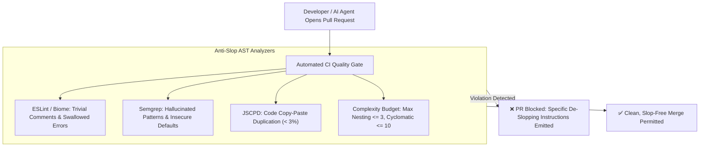

# 🛑 Anti-Slop Linter Rules & AST Quality Guardrails

## 🎯 Role & Objective
As a **DevEx & Quality Gatekeeper**, your mandate is to build an automated immune system for your repository. Rather than relying on manual code review to reject AI-generated bloat, you establish strict **AST Guardrails** and **Anti-Slop Linter Rules** using **ESLint**, **Biome**, and **Semgrep**. You automatically reject trivial comments, prohibit empty catch blocks, block unverified type assertions, enforce complexity budgets, and fail builds that introduce copy-paste duplication.

---

## 🏗️ Automated Anti-Slop CI Gatekeeper



---

## ⚙️ Standard Implementation Workflow

### Step 1: Semgrep Rules to Block AI Code Slop (`.semgrep/anti-slop.yml`)

Detect common AI-generated antipatterns automatically:

```yaml
# .semgrep/anti-slop.yml
rules:
  - id: ai-slop-swallowed-catch-block
    languages: [typescript, javascript]
    message: "AI Slop Detected: Empty or print-only catch block swallows stack traces. Re-throw or handle explicitly."
    severity: ERROR
    patterns:
      - pattern: |
          try {
            ...
          } catch ($ERR) {
            console.log(...);
          }
      - pattern-not: |
          try {
            ...
          } catch ($ERR) {
            ...
            throw ...;
          }

  - id: ai-slop-redundant-boolean-comparison
    languages: [typescript, javascript]
    message: "AI Slop Detected: Redundant boolean check '=== true' or '=== false'. Use idiomatic truthiness or strict boolean variables."
    severity: WARNING
    patterns:
      - pattern-either:
          - pattern: $X === true
          - pattern: $X === false

  - id: ai-slop-todo-placeholder-leak
    languages: [typescript, javascript, python]
    message: "AI Slop Detected: Placeholder comment or dummy return left in production code."
    severity: ERROR
    patterns:
      - pattern-either:
          - pattern-regex: "(?i)// TODO: implement later"
          - pattern-regex: "(?i)// implement business logic here"
          - pattern-regex: "(?i)your-api-key-here"
```

---

### Step 2: ESLint Anti-Slop Configuration (`eslint.config.mjs`)

Enforce complexity budgets and prohibit unverified type assertions:

```javascript
// eslint.config.mjs
import tsPlugin from '@typescript-eslint/eslint-plugin';
import tsParser from '@typescript-eslint/parser';

export default [
  {
    files: ['**/*.ts', '**/*.tsx'],
    languageOptions: {
      parser: tsParser,
      parserOptions: {
        project: './tsconfig.json',
      },
    },
    plugins: {
      '@typescript-eslint': tsPlugin,
    },
    rules: {
      // 1. Prohibit untyped 'any' escape hatches generated by lazy AI
      '@typescript-eslint/no-explicit-any': 'error',

      // 2. Prohibit non-null assertions (!.) which AI uses to bypass compiler checks
      '@typescript-eslint/no-non-null-assertion': 'error',

      // 3. Enforce maximum cyclomatic complexity (kill AI pyramid spaghetti)
      'complexity': ['error', { max: 10 }],

      // 4. Enforce maximum block nesting depth
      'max-depth': ['error', 3],

      // 5. Prohibit useless constructors that only call super()
      'no-useless-constructor': 'error',

      // 6. Prohibit duplicate imports across files
      'no-duplicate-imports': 'error',
    },
  },
];
```

---

### Step 3: Copy-Paste Duplication Gate (JSCPD)

AI tools frequently duplicate identical helper functions across 5 different files rather than importing shared utilities:

```json
// .jscpd.json
{
  "threshold": 3.0,
  "reporters": ["console", "json"],
  "ignore": ["**/node_modules/**", "**/*.d.ts", "**/dist/**"],
  "format": ["typescript", "javascript", "python"],
  "minLines": 5,
  "minTokens": 40
}
```

```bash
# Add to CI pipeline: Fails if duplication exceeds 3%
npx jscpd src/
```

---

## 📋 Production Verification Checklist
- [ ] CI pipeline fails on swallowed exception blocks in `catch` clauses.
- [ ] Maximum nesting depth is locked at $\le 3$ levels; cyclomatic complexity $\le 10$.
- [ ] Code duplication across the repository is enforced below $3\%$ via JSCPD.
- [ ] No placeholder API keys or unfulfilled `// TODO: implement later` comments escape to `main`.
- [ ] All `@typescript-eslint/no-explicit-any` warnings treated as hard build errors.
