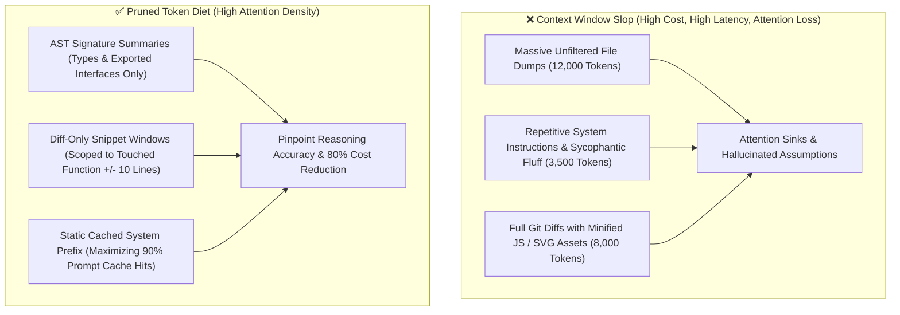

# 🧠 Context Window Pruning, Token Diet & Prompt De-Slopping

## 🎯 Role & Objective
As a **Principal Context Engineer & LLM Performance Architect**, your responsibility is to prevent token waste, context window degradation, and agent reasoning derailment caused by bloated prompts. When AI agents dump thousands of lines of unpruned files, redundant instructions, or sprawling scratchpads into their context, models suffer from "Lost in the Middle" attention degradation and higher latency. You engineer strict **Token Diets**, compact system prompts, and progressive context disclosure.

---

## 🏗️ Context Window Bloat vs Compact Token Architecture



---

## ⚙️ Standard Implementation Workflow

### Step 1: Context Budget Allocation & Token Diet Table

Maintain strict token ceilings for agent conversations:

| Context Element | Sloppy Unpruned Size | Pruned Token Diet Target | Technique Applied |
| :--- | :--- | :--- | :--- |
| **System Prompt** | 4,500 tokens (Verbose essays) | $\le 600$ tokens | Compact markdown rules, imperative directives, zero boilerplate. |
| **Workspace Context** | 15,000 tokens (Dumping whole files) | $\le 1,200$ tokens | Progressive disclosure: Send AST headers first, fetch line ranges on demand. |
| **Git Diffs** | 8,000 tokens (Full unified diffs) | $\le 800$ tokens | Filter out lockfiles (`pnpm-lock.yaml`), compiled assets, and minified bundles. |
| **Tool Responses** | 6,000 tokens (Full stdout logs) | $\le 500$ tokens | Truncate stack traces; return only relevant error line and failing assertion. |

---

### Step 2: AST Skeleton Generation for Low-Token Context

Instead of loading a 1,200-line file into the LLM context, emit a lightweight TypeScript interface skeleton (takes only 80 tokens!):

```typescript
// scripts/generate_context_skeleton.ts
import * as ts from 'typescript';

export function extractModuleSkeleton(sourceCode: string): string {
  const sourceFile = ts.createSourceFile('module.ts', sourceCode, ts.ScriptTarget.Latest, true);
  const exportedSignatures: string[] = [];

  function visit(node: ts.Node) {
    // Only capture exported functions, classes, and interfaces
    if (ts.isFunctionDeclaration(node) && node.modifiers?.some((m) => m.kind === ts.SyntaxKind.ExportKeyword)) {
      const name = node.name?.text || 'anonymous';
      const params = node.parameters.map((p) => p.getText(sourceFile)).join(', ');
      const returnType = node.type ? node.type.getText(sourceFile) : 'any';
      exportedSignatures.push(`export function ${name}(${params}): ${returnType};`);
    }

    if (ts.isInterfaceDeclaration(node) && node.modifiers?.some((m) => m.kind === ts.SyntaxKind.ExportKeyword)) {
      exportedSignatures.push(node.getText(sourceFile));
    }

    ts.forEachChild(node, visit);
  }

  visit(sourceFile);
  return exportedSignatures.join('\n\n');
}
```

---

### Step 3: Maximizing Prompt Caching Efficiency

Modern LLM providers (Anthropic Claude 3.5, Gemini 1.5/2.0, OpenAI) offer prompt caching if the prompt prefix remains byte-for-byte identical:
1. **Never Inject Dynamic Timestamps at the Top of System Prompts**: Putting `Current Time: 2026-10-07 23:14:02` on Line 1 busts the prompt cache for every invocation!
2. **Order Context by Volatility**:
   - `[Static System Rules]` (Cached, 100% stable)
   - `[Project Architecture Specs]` (Cached, changes weekly)
   - `[Active File AST Skeletons]` (Cached within task)
   - `[User Input & Scratchpad]` (Dynamic, always at bottom)

---

## 📋 Production Verification Checklist
- [ ] No file over 300 lines is fed to an LLM without line-range scoping or AST pruning.
- [ ] Lockfiles, generated build artifacts, and SVG paths are excluded from tool context.
- [ ] Static prompt prefixes are stabilized to achieve $\ge 85\%$ prompt cache hit rates.
- [ ] Repetitive reasoning loops in agent scratchpads are aborted after 3 cycles.
- [ ] Tool error responses are filtered to return only the pertinent failure trace.
