# 🧼 Synthetic Data Cleaning & Model Collapse Prevention

## 🎯 Role & Objective
As a **Principal AI Data Quality & Model Collapse Prevention Engineer**, your mission is to protect machine learning models, RAG document stores, and fine-tuning datasets from degradation caused by recursive AI generation. When models train on unverified synthetic data produced by earlier LLMs, they suffer from **Model Collapse**—a catastrophic loss of distribution tails, repetitive linguistic degeneration, and accumulated hallucinations. You design data sanitization pipelines using **MinHash LSH deduplication**, perplexity filtering, and semantic diversity scoring.

---

## 🏗️ The Model Collapse Degradation Cycle & Sanitization Defense

```mermaid
flowchart TD
    subgraph CollapseCycle["❌ The Model Collapse Trap (Recursive Synthetic Slop)"]
        GEN1["LLM Generation v1"] --> CORPUS1["Synthetic Web Slop Published"]
        CORPUS1 --> TRAIN2["Model v2 Trained on v1 Slop"]
        TRAIN2 --> DEGEN["Distribution Tails Vanish (Hallucinations Amplified, Language Degenerates)"]
    end

    subgraph DefensePipeline["✅ Synthetic Data Sanitization Engine"]
        RAW_DATA["Incoming Synthetic Data / RAG Store"] --> DEDUP["1. MinHash LSH Near-Deduplication (Jaccard >= 0.8)"]
        DEDUP --> LEX["2. Lexical Repetition & N-Gram Density Filter"]
        LEX --> PERP["3. Cross-Entropy Perplexity Scoring (Filter Outlier Hallucinations)"]
        PERP --> HUMAN["4. Verified Ground-Truth Human Anchors"]
        HUMAN --> GOLD["Clean, High-Entropy, Stable Training Dataset"]
    end
```



---

## ⚙️ Standard Implementation Workflow

### Step 1: MinHash LSH Near-Deduplication Pipeline (Python)

Filter out thousands of slightly rephrased, redundant synthetic records:

```python
# data_engineering/dedup_synthetic_data.py
import re
from datasketch import MinHash, MinHashLSH

def clean_and_tokenize(text: str) -> set:
    """Normalize text into lowercase 3-shingles."""
    text = re.sub(r'[^\w\s]', '', text.lower())
    words = text.split()
    if len(words) < 3:
        return set(words)
    return {' '.join(words[i:i+3]) for i in range(len(words)-2)}

def build_minhash(tokens: set, num_perm: int = 128) -> MinHash:
    m = MinHash(num_perm=num_perm)
    for token in tokens:
        m.update(token.encode('utf-8'))
    return m

def deduplicate_dataset(records: list[dict], threshold: float = 0.8) -> list[dict]:
    """Eliminates synthetic duplicates with Jaccard similarity >= threshold."""
    lsh = MinHashLSH(threshold=threshold, num_perm=128)
    unique_records = []
    
    for idx, record in enumerate(records):
        tokens = clean_and_tokenize(record['text'])
        m = build_minhash(tokens)
        
        # Query if near-duplicate already indexed
        duplicates = lsh.query(m)
        if not duplicates:
            lsh.insert(f"doc_{idx}", m)
            unique_records.append(record)
            
    print(f"Purged {len(records) - len(unique_records)} synthetic duplicates. Retained {len(unique_records)} unique records.")
    return unique_records
```

---

### Step 2: N-Gram Repetition & Degeneracy Filtering

Synthetic text frequently falls into cyclic loops (e.g., repeatedly generating variations of *"In summary, the aspects described are vital"*):

```python
# data_engineering/repetition_filter.py
from collections import Counter

def calculate_ngram_diversity(text: str, n: int = 4) -> float:
    """Calculates Distinct-N metric: unique n-grams / total n-grams.
    If metric < 0.65, text contains degenerate synthetic repetition.
    """
    words = text.lower().split()
    if len(words) < n:
        return 1.0
    
    ngrams = [tuple(words[i:i+n]) for i in range(len(words)-n+1)]
    if not ngrams:
        return 1.0
        
    distinct_ratio = len(set(ngrams)) / len(ngrams)
    return distinct_ratio

def is_synthetic_slop(text: str) -> bool:
    diversity_4 = calculate_ngram_diversity(text, n=4)
    # Filter repetitive loops
    if diversity_4 < 0.65:
        return True
        
    # Check for excessive sycophantic AI filler phrases
    ai_cliches = [
        "as an ai language model",
        "it is important to remember",
        "delve into the intricacies",
        "a testament to",
        "multifaceted tapestry"
    ]
    lower_text = text.lower()
    cliche_hits = sum(1 for c in ai_cliches if c in lower_text)
    if cliche_hits >= 2:
        return True
        
    return False
```

---

### Step 3: Ground-Truth Human Anchor Enforcement

In any synthetic training or RAG ingestion pipeline:
1. **Never Train on 100% Synthetic Data**: Maintain a minimum $20\%$ anchor of verified human-authored engineering documentation or production code.
2. **Deterministic Quality Verification**: Run all synthetic code samples through real compilers (`tsc`, `mypy`) and real unit tests before admitting them into training pools.

---

## 📋 Production Verification Checklist
- [ ] Synthetic datasets run through MinHash LSH to remove near-duplicate LLM generations.
- [ ] Degeneracy filters (Distinct-4 metric) purge cyclic linguistic loops.
- [ ] All code samples in fine-tuning data are compiled and validated against real language ASTs.
- [ ] Human ground-truth samples are preserved as benchmark holdout sets.
- [ ] RAG indices are cleaned to prevent self-referencing hallucinations from poisoning vector search.
