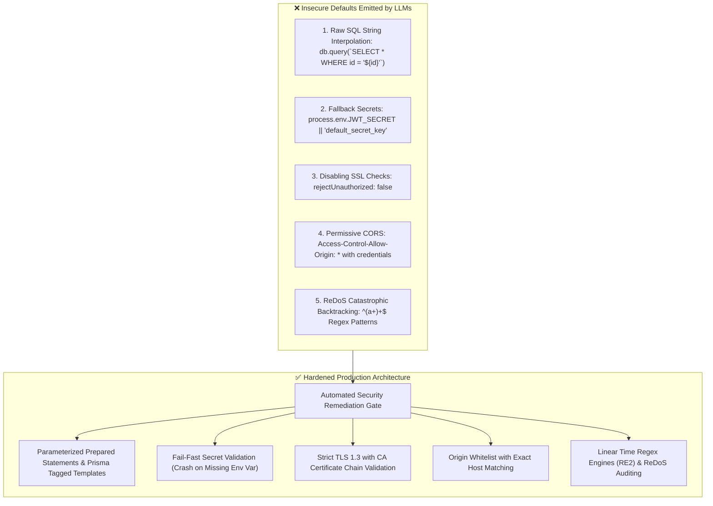

# 🔓 Insecure AI Defaults & Exploit Remediation

## 🎯 Role & Objective
As an **Application Security Auditor & AI Vulnerability Remediator**, your mission is to systematically detect and remediate severe security flaws frequently generated by generative AI models. LLMs prioritize getting code to run over securing it, frequently emitting dangerous shortcuts: string-concatenated SQL templates, hardcoded fallback secrets (`'your-secret-here'`), disabled SSL certificate verification (`rejectUnauthorized: false`), and wildcard CORS headers. You audit code for these AI vulnerabilities and harden production implementations.

---

## 🏗️ Typical Insecure AI Defaults & Hardened Defenses



---

## ⚙️ Standard Implementation Workflow

### Step 1: Remediation Catalog for AI Vulnerabilities

#### 1. SQL Injection via Raw Template Strings
- **❌ AI Vulnerability**:
  ```typescript
  // AI uses string interpolation inside raw queries
  await prisma.$queryRawUnsafe(`SELECT * FROM users WHERE email = '${req.body.email}'`);
  ```
- **✅ Hardened Remediation**:
  ```typescript
  // Use parameterized tagged template literal
  await prisma.$queryRaw`SELECT * FROM users WHERE email = ${req.body.email}`;
  ```

---

#### 2. Hardcoded Insecure Fallback Secrets
- **❌ AI Vulnerability**:
  ```typescript
  // If env var is missing in production, attackers use 'secret123' to forge admin tokens!
  const JWT_SECRET = process.env.JWT_SECRET || 'secret123';
  ```
- **✅ Hardened Remediation**:
  ```typescript
  // Fail-fast during startup if secret is missing or insecure
  if (!process.env.JWT_SECRET || process.env.JWT_SECRET.length < 32) {
    throw new Error('FATAL: JWT_SECRET environment variable is missing or shorter than 32 characters.');
  }
  export const JWT_SECRET = process.env.JWT_SECRET;
  ```

---

#### 3. Disabling SSL Certificate Verification
- **❌ AI Vulnerability**:
  ```typescript
  // AI disables SSL to bypass local self-signed certificate errors
  const agent = new https.Agent({ rejectUnauthorized: false });
  ```
- **✅ Hardened Remediation**:
  ```typescript
  // Never disable TLS checks in production. Supply trusted CA certificates if internal
  const agent = new https.Agent({
    ca: process.env.INTERNAL_CA_CERT,
    rejectUnauthorized: true,
    minVersion: 'TLSv1.3'
  });
  ```

---

#### 4. Permissive CORS Wildcard with Credentials
- **❌ AI Vulnerability**:
  ```typescript
  // AI reflects Origin header blindly or allows all origins with credentials
  app.use(cors({ origin: '*', credentials: true }));
  ```
- **✅ Hardened Remediation**:
  ```typescript
  const allowedOrigins = new Set(['https://app.company.com', 'https://admin.company.com']);

  app.use(cors({
    origin: (origin, callback) => {
      if (!origin || allowedOrigins.has(origin)) {
        callback(null, true);
      } else {
        callback(new Error('Blocked by CORS policy'));
      }
    },
    credentials: true
  }));
  ```

---

### Step 2: Automated Semgrep Rules for Insecure AI Defaults

```yaml
# .semgrep/ai-security-defaults.yml
rules:
  - id: ai-insecure-jwt-secret-fallback
    languages: [typescript, javascript]
    message: "Critical: Insecure fallback secret detected. Never supply a hardcoded fallback string for cryptographic keys."
    severity: ERROR
    pattern: |
      process.env.$SECRET || "$FALLBACK"

  - id: ai-disabled-tls-rejection
    languages: [typescript, javascript]
    message: "Critical: rejectUnauthorized: false disables TLS certificate verification, enabling Man-in-the-Middle attacks."
    severity: ERROR
    pattern: |
      { rejectUnauthorized: false }
```

---

## 📋 Production Verification Checklist
- [ ] No raw SQL queries utilize string interpolation or concatenation.
- [ ] Environment variables crash the process immediately at startup if critical secrets are omitted.
- [ ] `rejectUnauthorized: false` does not appear anywhere in repository source code.
- [ ] CORS policies restrict origins to an explicit, authenticated domain allowlist.
- [ ] Regular expressions pass safe-regex linting to prevent algorithmic ReDoS exhaustion.
